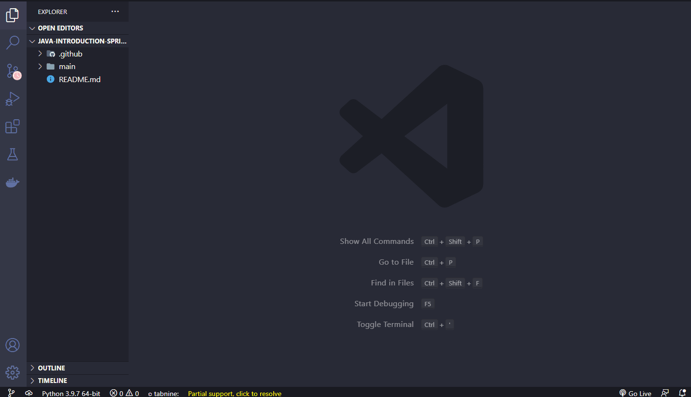
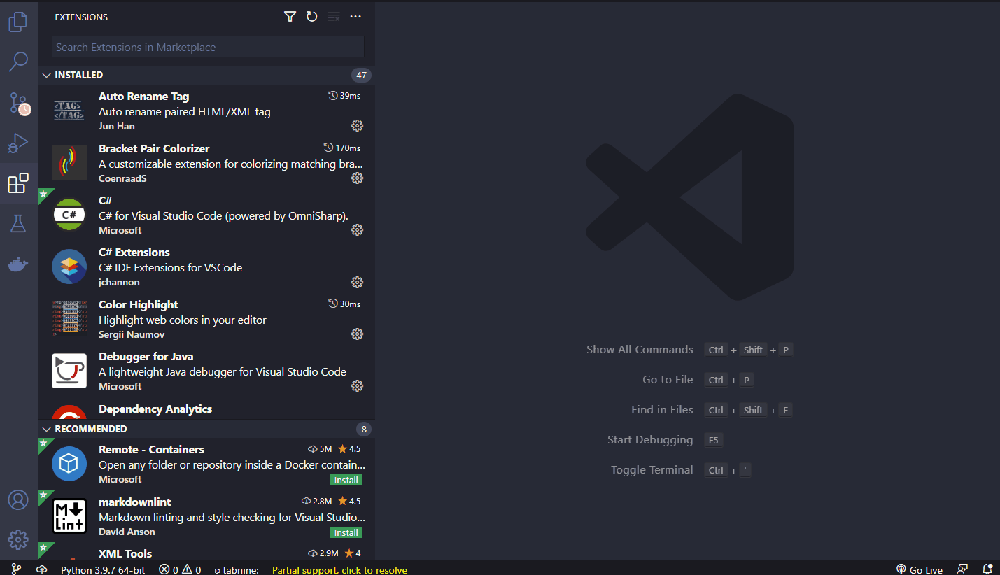
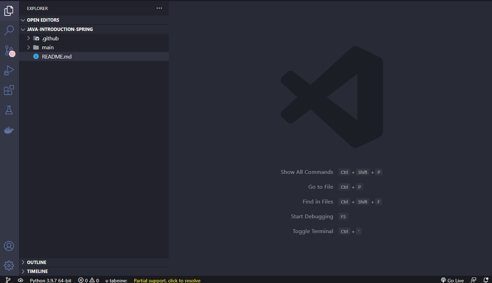

<h1 align="center">
  
   
  First Java configurations and dependencies on VSCode.
</h1>

<h3 align="justify">
 Instructions on how to install Java, Windows operating system variable settings, JAVA_HOME, Plugins in VSCode and setups to configure java in it.
</h3>

 

## 📷 Demonstration

  <h4 align="left"> Install Java for Windows </h4>
  
   
  <h4 align="left"> Editing Windows System Variables </h4>
  
   
  <h4 align="left"> Setting up Java Home in VSCode </h4>
  
   
  <h4 align="left"> Extensions </h4>
  
   
  <h4 align="left"> Creating Java Application with Spring </h4>
  
   

 

## 🚀 Technologies

This project was developed with the following technologies:

- Java
- Spring Boot
- Maven

 

## ⚙ Settings
- Install Java Recent Version | https://www.oracle.com/br/java/
- Propriedades do Sistema | Variaveis de Ambiente | Variaveis do Sistema | Novo | Edição do Path c/ "path install" | Criação de "JAVA_HOME" c/ "path install"
- Ctrl+, | Home | Setting | Edit Setting Json | "Path"
- Extension Pack Java | Spring Boot Extension Pack | Lombok
 

---

Made with 💜 by Rafael Maciel
